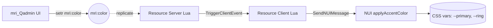

import { Meta } from "@storybook/blocks";

<Meta title="Design System/Tematização" />

# Tematização

O ui-kit é construído sobre **tokens shadcn em HSL**. O token-chave é `--primary`,
que alimenta `bg-primary`, `text-primary`, `border-primary`, `--ring` e qualquer
shadow no formato `hsl(var(--primary) / N)`. Trocar essa única variável muda toda
a paleta de destaque ao vivo, sem rebuild.

## Tokens esperados no `:root`

Defina os tokens no seu CSS global antes de importar componentes do ui-kit:

```css
@tailwind base;
@tailwind components;
@tailwind utilities;

@layer base {
  :root {
    --background: 240 10% 4%;
    --foreground: 0 0% 98%;
    --card: 240 10% 6%;
    --card-foreground: 0 0% 98%;
    --popover: 240 10% 6%;
    --popover-foreground: 0 0% 98%;

    /* Cor de destaque — sobrescrita em runtime via applyAccentColor() */
    --primary: 160 100% 45%;          /* HSL space-separated, sem hsl() */
    --primary-foreground: 144 100% 10%;
    --primary-rgb: 0, 230, 153;        /* opcional, pra rgb(var(--primary-rgb)/N) */

    --secondary: 240 5% 15%;
    --secondary-foreground: 0 0% 98%;
    --muted: 240 5% 15%;
    --muted-foreground: 240 5% 60%;
    --accent: 240 5% 15%;
    --accent-foreground: 0 0% 98%;
    --destructive: 0 62.8% 30.6%;
    --destructive-foreground: 0 0% 98%;
    --border: 240 5% 15%;
    --input: 240 5% 15%;
    --ring: var(--primary);
    --radius: 0.5rem;
  }

  * { @apply border-border; }
  body { @apply bg-background text-foreground antialiased; }
}
```

E no `tailwind.config.js`:

```js
export default {
  darkMode: ['class'],
  content: [
    './src/**/*.{js,ts,jsx,tsx}',
    './node_modules/@mriqbox/ui-kit/dist/**/*.{js,mjs}',
  ],
  theme: {
    extend: {
      colors: {
        primary: { DEFAULT: 'hsl(var(--primary))', foreground: 'hsl(var(--primary-foreground))' },
        // ...demais tokens shadcn
      },
      borderRadius: {
        lg: 'var(--radius)',
        md: 'calc(var(--radius) - 2px)',
        sm: 'calc(var(--radius) - 4px)',
      },
    },
  },
  plugins: [require('tailwindcss-animate')],
}
```

## Mudando a cor de destaque em runtime

`--primary` aceita HSL space-separated (`H S% L%`), não hex direto. O helper
`applyAccentColor(hex)` converte e seta todas as vars derivadas:

```ts
function applyAccentColor(hex: string) {
  const m = hex.match(/^#([0-9a-f]{2})([0-9a-f]{2})([0-9a-f]{2})$/i);
  if (!m) return;
  const r = parseInt(m[1], 16) / 255;
  const g = parseInt(m[2], 16) / 255;
  const b = parseInt(m[3], 16) / 255;
  const max = Math.max(r, g, b);
  const min = Math.min(r, g, b);
  const l = (max + min) / 2;
  let h = 0, s = 0;
  if (max !== min) {
    const d = max - min;
    s = l > 0.5 ? d / (2 - max - min) : d / (max + min);
    if (max === r) h = ((g - b) / d + (g < b ? 6 : 0));
    else if (max === g) h = ((b - r) / d + 2);
    else h = ((r - g) / d + 4);
    h *= 60;
  }
  const token = `${Math.round(h)} ${Math.round(s * 100)}% ${Math.round(l * 100)}%`;
  const fg = l < 0.5 ? '210 40% 98%' : '240 10% 4%';
  const root = document.documentElement;
  root.style.setProperty('--primary', token);
  root.style.setProperty('--ring', token);
  root.style.setProperty('--primary-foreground', fg);
  root.style.setProperty('--primary-rgb', `${parseInt(m[1], 16)}, ${parseInt(m[2], 16)}, ${parseInt(m[3], 16)}`);
}
```

> **Por que HSL e não hex?** Tailwind shadcn compõe alphas como
> `hsl(var(--primary) / 0.5)`. Se a var fosse hex, isso quebraria — o navegador
> não consegue aplicar opacidade num literal hex.

## MRI Suite — convar `mri:color`

Os resources do ecossistema MRI compartilham uma convar replicate
**`mri:color`** (default `#00E699`). Cada resource lê via `GetConvar` no Lua,
manda o hex pra NUI no boot, e a NUI chama `applyAccentColor()`.



### 1. Server (shared/server Lua)

Lê a convar no carregamento do shared script — em `config.lua`:

```lua
Config.AccentColor = GetConvar('mri:color', '#00E699')
```

> Convar é replicate (`setr`, não `set`). Cliente também lê direto se precisar.

### 2. Broadcast em runtime (server)

Quando o admin troca a cor (via `mri_Qadmin` ou `setr` no console), o resource
propaga pra NUIs já abertas:

```lua
AddConvarChangeListener('mri:color', function(name)
    if name ~= 'mri:color' then return end
    local color = GetConvar('mri:color', '#00E699')
    TriggerClientEvent('mri_<resource>:client:accentColorChanged', -1, color)
end)
```

### 3. Client → NUI

```lua
RegisterNetEvent('mri_<resource>:client:accentColorChanged', function(newColor)
    SendNUIMessage({ action = 'updateAccentColor', accentColor = newColor })
end)
```

### 4. NUI listener

```tsx
useEffect(() => {
  const handler = (event: MessageEvent) => {
    const { action, accentColor } = event.data || {};
    if (action === 'updateAccentColor' && /^#[0-9a-f]{6}$/i.test(accentColor)) {
      applyAccentColor(accentColor);
    }
  };
  window.addEventListener('message', handler);
  return () => window.removeEventListener('message', handler);
}, []);
```

## NUIs efêmeras (loadscreens)

Loadscreen só existe durante o handshake do connect — broadcast em runtime não
faz sentido (a NUI já foi destruída quando o player entra). Padrão correto:
**re-ler `GetConvar` na hora do `deferrals.handover`**, sem cachear:

```lua
deferrals.handover({
    accentColor = GetConvar('mri:color', '#00E699'),
})
```

`Config.AccentColor` em memória fica desatualizado (avaliado uma vez no boot do
shared_script). Reler explicitamente garante que cada reconnect pega a cor atual.

## Persistência

Convar `setr` em runtime **não persiste reboot**. Para sobreviver restart, o
controlador (`mri_Qadmin`) salva em DB e reaplica `ExecuteCommand('setr ...')`
no boot:

```lua
local function applyAccentConvar()
    local color = isValidHex(Config.accent_color) and Config.accent_color or '#00E699'
    SetConvarReplicated('mri:color', color)  -- API nativa, melhor que ExecuteCommand
end
```

## Recomendações para novos resources

1. **Ler `mri:color` no shared_script** — `Config.AccentColor = GetConvar('mri:color', '#00E699')`
2. **Default literal sempre `#00E699`** — mantém a suite homogênea
3. **Trocar inline styles por classes** — `style={{ backgroundColor: hex }}` →
   `bg-primary`, `text-primary`, `border-primary`, `shadow-[0_0_15px_hsl(var(--primary)/0.5)]`
4. **Validar hex** com `/^#[0-9a-f]{6}$/i` antes de aplicar
5. **Para NUIs persistentes**, registrar `AddConvarChangeListener` no server e
   listener `updateAccentColor` no NUI
6. **Para NUIs efêmeras**, re-ler `GetConvar` no momento de mostrar (não cachear)

## Resources que seguem o pattern

<table className="w-full border-collapse text-sm mt-4">
  <thead>
    <tr className="border-b border-border">
      <th className="text-left p-2 font-semibold">Resource</th>
      <th className="text-left p-2 font-semibold">Modo</th>
      <th className="text-left p-2 font-semibold">Broadcast runtime</th>
    </tr>
  </thead>
  <tbody>
    <tr className="border-b border-border/40">
      <td className="p-2"><code>mri_Qmultichar</code></td>
      <td className="p-2">NUI persistente</td>
      <td className="p-2">✅</td>
    </tr>
    <tr className="border-b border-border/40">
      <td className="p-2"><code>mri_Qspawn</code></td>
      <td className="p-2">NUI persistente</td>
      <td className="p-2">✅</td>
    </tr>
    <tr className="border-b border-border/40">
      <td className="p-2"><code>mri_Qadmin</code></td>
      <td className="p-2"><strong>Controlador</strong> + NUI persistente</td>
      <td className="p-2">✅</td>
    </tr>
    <tr>
      <td className="p-2"><code>mri_Qloadscreen</code></td>
      <td className="p-2">NUI efêmera (handshake)</td>
      <td className="p-2">❌ (re-lê no handover)</td>
    </tr>
  </tbody>
</table>
